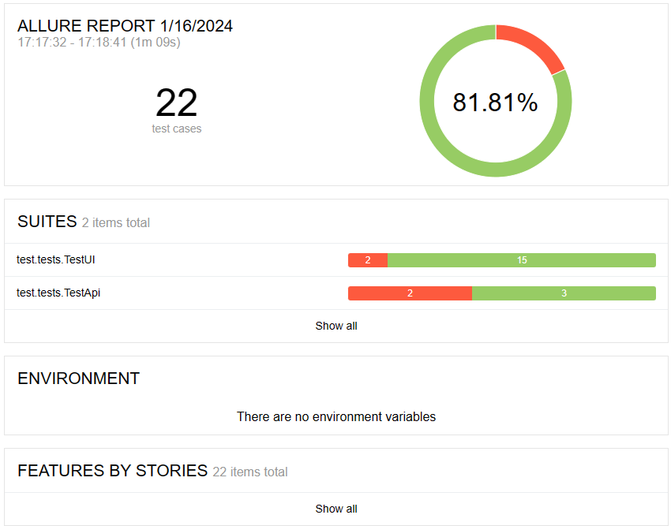
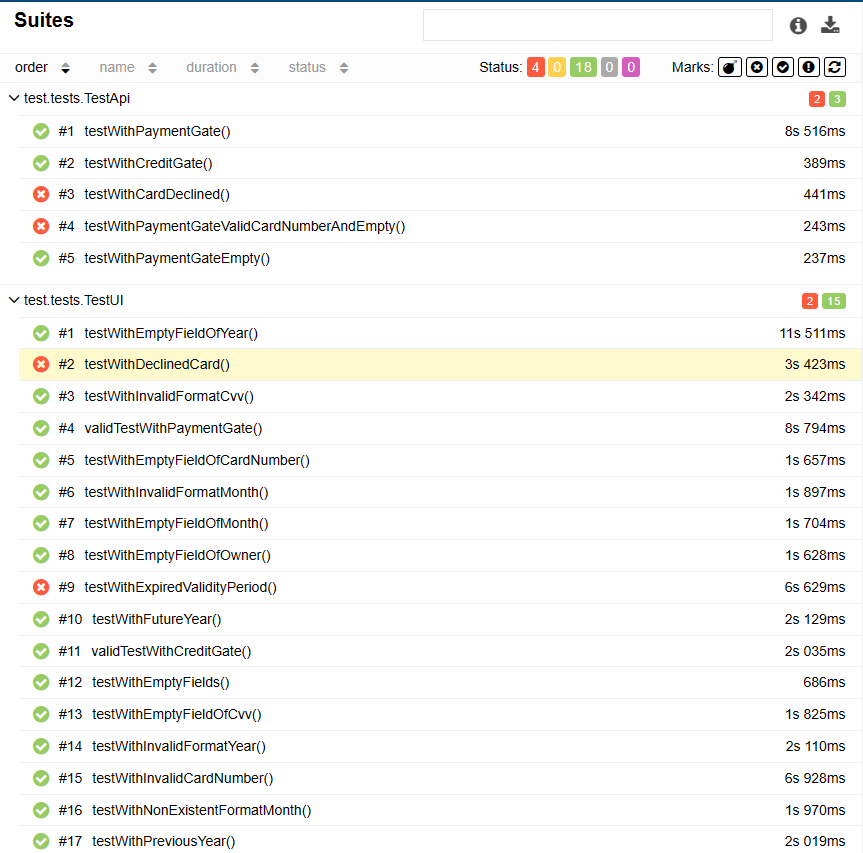

# Итоги

## Что было запланировано и что было реализовано

1. Проведено тестирование функционала веб-сервиса покупки тура "Путешествие дня".i
2. Составлен план автоматизации предусматривающий 22 тестовых сценариев. Из них 5 сценариев API и 17 UI.
3. Автоматизированы 22 тестовых сценария.
4. Подготовлен отчет по результату прогона тестов.
5. Подготовка отчетов о найденных багах (см. Issues).

## Причины, по которым что-то не было реализовано

В полной мере не реализованы запросы в базу, из-за большого количества ошибок и отсутствия опыта.

## Сработавшие риски:

- отсутствие технической документации замедлило работу;
- отсутствие тестовых меток в структуре страницы для реализации автотестов;
- большое количество "багов" увеличило время написания автотестов;
- обнаружены пробелы в знаниях и умениях написания автотестов;
- написание диплома выпало на конец года, из-за чего удалось уделять меньше времени чем было запланировано.  

## Общий итог по времени: сколько запланировали и сколько выполнили с обоснованием расхождения
1. Предварительная настройка

    **__запланировано:__** 6 часов

    **__уделено:__** 2 часа  

2. Написание автотестов

   **__запланировано:__** 24 часа

   **__уделено:__** 42 часа

3. Создание баг-репортов и отчетов по результатам выполнения автотестов

   **__запланировано:__** 12 часов

   **__уделено:__** 4 часа

4. Подготовка итогового отчета по автоматизации
  
   **__запланировано:__** 6 часов

   **__уделено:__** 2 часа

ИТОГО: **__запланировано:__** 48 часов,     **__уделено:__** 50 часов 

### Отчет ALLURE

